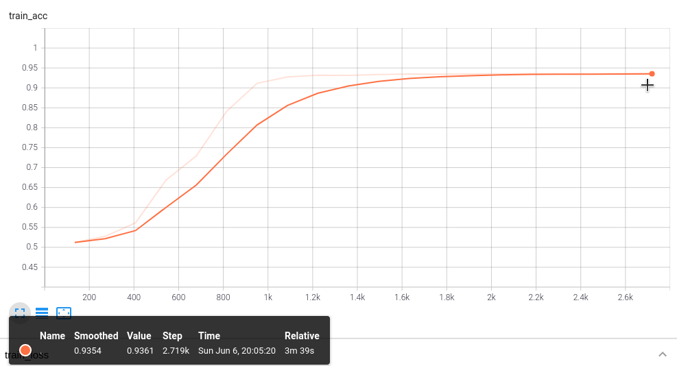
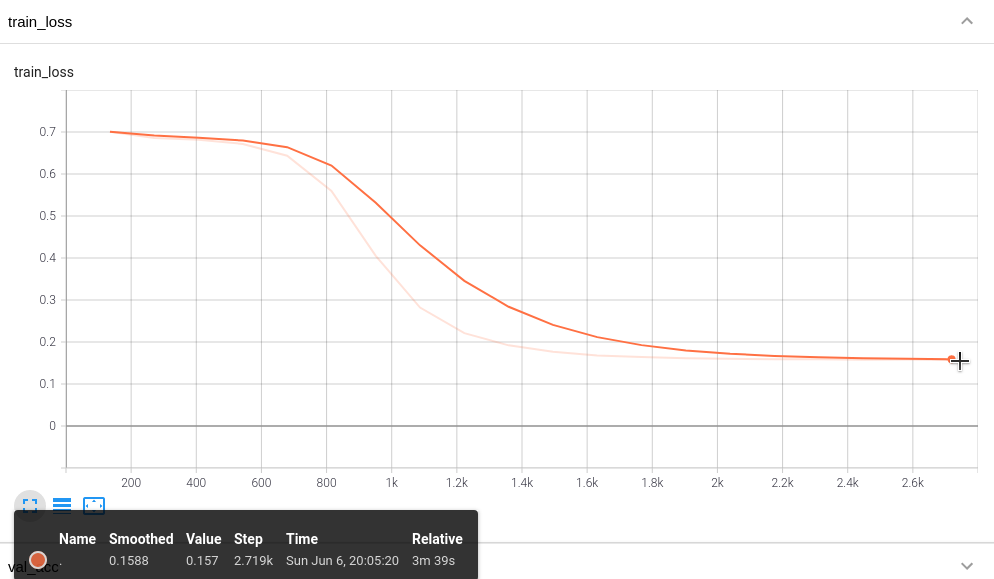
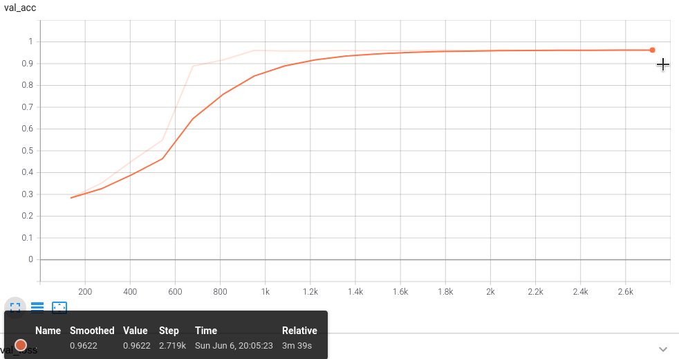
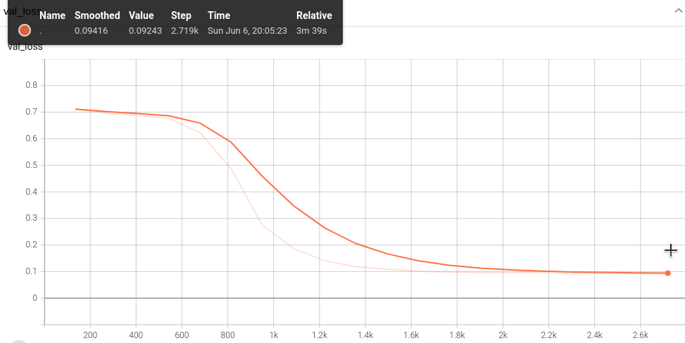

# Transformerによる仮想通貨の価格変化率予測

## ・概要
ディープラーニングの'Transformer'を用いて、仮想通貨の価格変化率が'-'になるか'+'になるかを予測します。  
'Transformer'のモデルについては、https://deeplearning.hatenablog.com/entry/transformer をご参照ください。  
また、時系列予測への適用については、 https://blog.brainpad.co.jp/entry/2021/02/17/140000 をご参照ください。  

## ・実行環境
python 3.8.5  
numpy == 1.19.2  
pandas == 1.2.4  
pytorch == 1.8.1+cu111  
pytorch_lightning == 1.3.0  
ax == 0.1.20  
tensorflow == 2.4.1  
tensorboard == 2.4.1  
CUDA == 11.2  
GPU・・・GeForce RTX 2060  

## ・フォルダについて
check_points/roc_model・・・学習後のパラメータ。モデルを推論で使いたい場合は、ここにある'.ckpt'ファイルをロードします。  
dev_env・・・コードの開発、実行環境。Docker imageの元となる'Dockerfile'とVSCodeの個人的な設定である'settings.json'が入ってます。   
tb_logs/roc_log/version_0・・・学習の過程を可視化したファイル。tensorboardで可視化できます。 

## ・ファイルについて
※colabへのリンクは閲覧用です。パッケージバージョンの違いから、動作しません。    
roc_trans.ipynb・・・モデルの学習から結果の表示までを行うnotebook。    
data_info.ipynb・・・学習データの詳細と変形についての詳細を説明したnotebook。  
mydlmodules.py・・・モデルで使うモジュール。  
mydlnet.py・・・モデルを定義しているモジュール。    
ohlc_maker.py・・・取得した元データの整形モジュール。  
test_min_BTCJPY.csv・・・'ohlc_maker.py'で整形したテストデータ。'2021.05.12 21:00:00 〜 2021.05.24 09:00:00'の分足チャート。  
train_min_BTCJPY.csv・・・ohlc_maker.py'で整形した学習データ。'2017.07.04 17:01:00 〜 2017.08.3 17:00:00'の分足チャート。  
val_min_BTCJPY.csv・・・ohlc_maker.py'で整形した検証データ。'2017.08.03 17:01:00 〜 2017.08.10 17:00:00'の分足チャート。   

## ・使用したデータについて
https://api.bitcoincharts.com/v1/csv/ から入手した'bitflyerJPY.csv.gz'を、使用しています。  

## ・入力について
モデルの入力値は、ビットコインの分足始値を12時間前からの価格変化率に変換し、30分ごとに時間間隔1分で過去の価格変化率を連結させた30次元のベクトル(Time Delay Embedding)です。  
入力される訓練データは、使用データの古いものから30日間の分足。  
検証データは、訓練データから1週間の分足。  
テストデータは、直近の暴落相場である約12日間の分足。
### 価格変化率
  
 = 時刻tにおける価格変化率、 = 時刻tにおける価格、 = 時刻tの720分前(12時間前)の価格

### TDE(Time Delay Embedding)
  
時間tごとに、時間間隔τで過去の値xを連結させたd次元のベクトル

## ・出力について
1分後の分足始値の12時間前からの価格変化率が'-'か'+'を予測します。  
予測は、モデルから出力された2つの値をsoftmax関数で活性化し、活性化後の値が大きい方を「モデルの予測」としています。  
例えば、活性化後の値が[0.49, 0.51]であれば、モデルの予測は'+'になります。  
損失関数と予測精度の詳細については'portfolio_01/mydlnet.py/TSTransformerClass/'も合わせてご参照ください。

## ・データの入手からモデルの学習結果出力までの流れ
1. 'bitflyerJPY.csv.gz'を解凍して、MySQLのデータベースに保存。
2. 'ohlc_maker.py'を使用して、データを取り出して整形。  
   整形したデータを'train_min_BTCJPY.csv', 'val_min_BTCJPY.csv', 'test_min_BTCJPY.csv'として保存。 
3. 整形した価格データを12時間前の価格との価格変化率に変換。
4. 'mydlmodules.py'を使用して、データをモデルに入力できる'Time Delay Embedding'に変換後'Dataloader'に変形。
5. 'mydlnet.py'で定義したモデルで学習、結果を出力。

## ・学習結果
### train_acc(学習データでの精度)  
  
  
### train_loss(学習データでの損失)  
  
  
### val_acc(検証データでの精度)  
  
  
### val_loss(検証データでの損失)  
  
  
### test_acc(テストデータでの精度) = 93%  
### test_loss(テストデータでの損失) =  0.17
## ・参考URL
https://deeplearning.hatenablog.com/entry/transformer  
https://blog.brainpad.co.jp/entry/2021/02/17/140000  
https://arxiv.org/abs/2001.08317  
https://sigfin.org/022-17/

